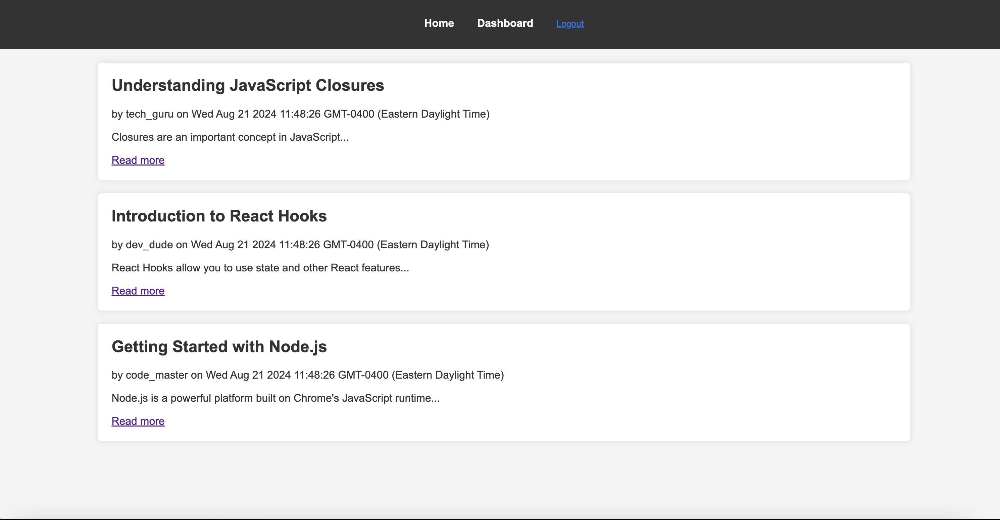
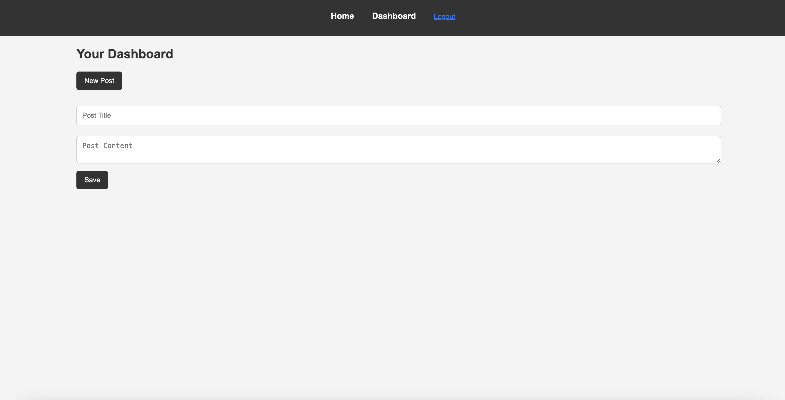

# Tech Blog

## Description

Tech Blog is a CMS-style blog site designed for developers to publish blog posts, share their thoughts, and interact with other developers through comments. This application follows the MVC (Model-View-Controller) paradigm and is built using Node.js, Express.js, Sequelize, Handlebars.js, and a PostgreSQL database. It includes user authentication and allows users to sign up, log in, create posts, and comment on posts by other users.

## Table of Contents

- [Installation](#installation)
- [Usage](#usage)
- [Features](#features)
- [Screenshots](#screenshots)
- [Technologies Used](#technologies-used)
- [License](#license)
- [Questions](#questions)

## Installation

To get a local copy of this project up and running, follow these simple steps:

1. **Clone the Repository**
   ```bash
   git clone https://github.com/ICONN21/tech-blog.git

2. Navigate to Project Directory:
    cd blogpost-challenge

3. npm install

4. Set up .env variables

5. Initalize Database
    npm run seed

6. npm start

## Usage
   . Sign Up: Create a new account to start posting your blogs.
   . Log In: Log in to your account to access the dashboard.
   . Create a Post: Write a new blog post from the dashboard.
   . Comment on Posts: Engage with other developers by commenting on their posts.

## Features
   . User authentication with secure password hashing.
   . Create, edit, and delete blog posts.
   . Comment on blog posts.
   . Responsive design for seamless experience across devices.
   . MVC architecture with Handlebars.js for templating.
   . Sequelize ORM with PostgreSQL for database management.

## Screenshots

*Screenshot of the homepage displaying blog posts.*


*Screenshot of the user dashboard for managing posts.*


## Technologies Used
   . Node.js
   . Express.js
   . Sequelize
   . PostgreSQL
   . Handlebars.js
   . bcrypt
   . dotenv
   . express-session 

## License
. This project is licensed under the MIT license.  See the LICENSE file for details.

## Questions
If you have any questions about this project please feel free to reach out:
    . GitHub: ICONN21
    . Email: Ian.connor0921@gmail.com